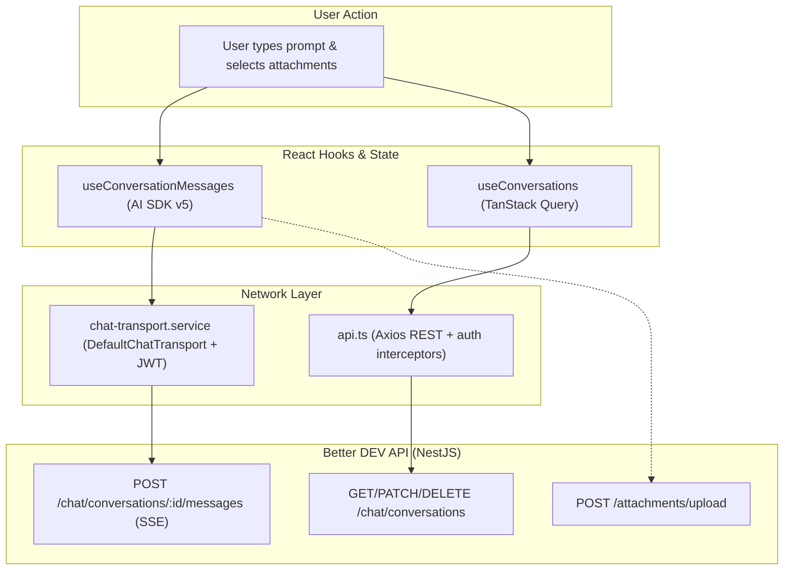

# Better DEV UI

> React 19 web client for Better DEV, a multi-modal AI chat platform with SSE streaming, tool-call visualization, file attachments, and conversation management.

[](https://react.dev/)
[](https://www.typescriptlang.org/)
[](https://vitejs.dev/)
[](https://tailwindcss.com/)
[](https://sdk.vercel.ai/)

## Overview

Better DEV UI is the frontend for the [Better DEV API](https://github.com/Kashif-Rezwi/better-dev-api), a multi-modal AI chat platform. It provides a dark-themed chat interface with real-time SSE streaming, autonomous tool-call visualization, image/document attachments, and per-conversation operational modes.

- **Production URL**: [better-dev-ui.vercel.app](https://better-dev-ui.vercel.app)
- **Backend API**: [better-dev-api](https://github.com/Kashif-Rezwi/better-dev-api) — health check at [better-dev-api.onrender.com/health](https://better-dev-api.onrender.com/health)
- **Engineering standards**: see [ARCHITECTURE.md](./ARCHITECTURE.md)

## Features

### Chat & streaming

- **Real-time SSE streaming** — token-by-token responses via `useChat` and `DefaultChatTransport` (Vercel AI SDK v5).
- **Operational mode switcher** — Fast (quick & concise), Thinking (detailed & comprehensive), or Auto (AI decides). The preference persists to local storage and is sent to the API as a per-request override.
- **System prompt customization** — per-conversation instructions edited in the right-hand panel (drafted locally for new conversations).
- **Auto title generation** — conversation titles are AI-generated in the background from the first message.

### Tool calling

- **Tool status cards** — web-search calls render as expandable status cards with pending/success/error states.
- **Sources & citations** — search results appear as a favicon source grid, and the AI-generated summary renders `[n]` citation links that open sources in a new tab.

### Attachments & files

- **Drag-and-drop attachments** — images, PDFs, and `.docx` files with client-side validation (10 MB max, 5 per message).
- **Upload progress** — per-file progress tracking with error handling and blob-URL cleanup.

### UX & state

- **Optimistic mutations** — conversation creation and deletion update the list instantly with query-cache rollback on error (TanStack Query).
- **Smart scroll management** — auto-scroll pauses when you scroll up; a scroll-to-bottom button appears when needed.
- **Markdown rendering** — GFM-powered messages with code blocks that include a header and copy button.
- **Dark-themed UI** — Tailwind CSS v4 design tokens on headless Radix UI primitives, with Sonner toasts.

## Tech Stack

| Layer | Technologies |
| :--- | :--- |
| Core framework | React 19, TypeScript 5.9, Vite 7 |
| Styling & UI | Tailwind CSS 4, Radix UI primitives, Ionicons (react-icons), Sonner |
| State & cache | TanStack Query v5, React Hook Form, safe localStorage wrapper |
| Streaming & AI | Vercel AI SDK v5 (`useChat`, `DefaultChatTransport`) |
| Markdown | `react-markdown`, `remark-gfm` |

## Project Structure

```
better-dev-ui/
├── public/                      # Static assets & logos
├── src/
│   ├── components/              # Feature + layout components
│   │   ├── actions-panel/       # Left sidebar (recents, user profile)
│   │   ├── activities-panel/    # Right sidebar (system prompt editor)
│   │   ├── chat-area/           # Message list, composer, mode selector, tool cards
│   │   ├── common/              # Markdown, ProtectedRoute, ErrorBoundary, ConfirmDialog, …
│   │   └── ui/                  # Headless Radix primitives (Button, Dialog, Dropdown, …)
│   ├── constants/               # Routes, storage keys, API config, validation rules
│   ├── hooks/                   # Domain & UI hooks (conversations, auth, panels, attachments)
│   ├── pages/                   # ChatPage, LoginPage, RegisterPage (lazy-loaded routes)
│   ├── services/                # Pure TypeScript API clients & transport
│   ├── types/                   # Domain types & discriminated unions
│   ├── utils/                   # Pure helpers (cn, date, message, storage, toast)
│   ├── App.tsx                  # Route setup with code-splitting
│   ├── main.tsx                 # React entry point
│   └── index.css                # Tailwind v4 theme & typography
├── ARCHITECTURE.md              # Engineering standards & guidelines
├── vercel.json                  # Vite framework + SPA rewrites
└── package.json
```

## Architecture & Data Flow



## Getting Started

Prerequisites: Node.js 20.19+ (Vite 7 requirement).

```bash
# 1. Clone & install
npm install

# 2. Start the development server
npm run dev
```

Open `http://localhost:3000` (override the port with `VITE_CLIENT_PORT`). A running instance of the API is expected at `http://localhost:3001` — see the [API repository](https://github.com/Kashif-Rezwi/better-dev-api).

### Build & validation

```bash
npm run build    # TypeScript check + Vite production bundle
npm run preview  # preview the production build locally
npm run lint     # ESLint
```

## Environment Variables

Create a `.env` file in the root:

```env
# Vite dev server port
VITE_CLIENT_PORT=3000

# Backend API base URL
VITE_API_BASE_URL=http://localhost:3001
# Production:
# VITE_API_BASE_URL=https://better-dev-api.onrender.com
```

## Deployment

The frontend is deployed to [Vercel](https://vercel.com). `vercel.json` configures the Vite build (`npm run build`, output `dist`) and rewrites all single-page application routes to `index.html`. Set `VITE_API_BASE_URL` in the Vercel project settings; deployments are connected through the Vercel dashboard.

## Related Repositories

- [better-dev-api](https://github.com/Kashif-Rezwi/better-dev-api) — the NestJS backend this client talks to.

## License

No license file is present.
